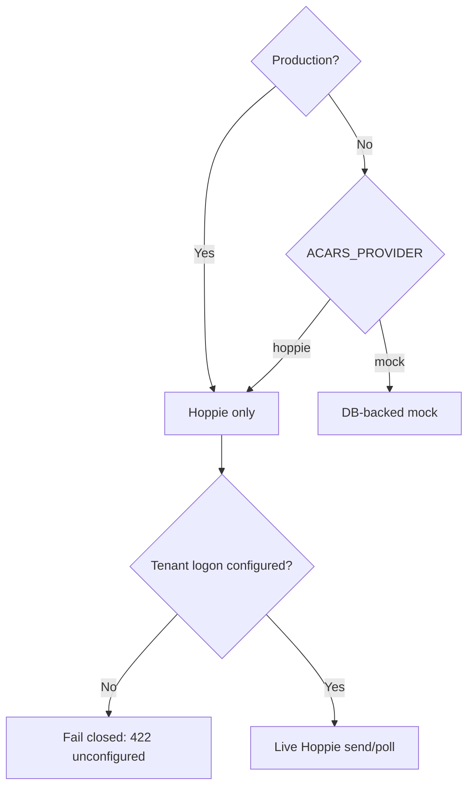

# ACARS and Hoppie

VA Dispatch provides a dispatcher-only web ACARS workspace. Production uses [Hoppie's ACARS network](https://www.hoppie.nl/acars/) as a store-and-forward free-text telex transport. Local development and automated tests can use an isolated PostgreSQL-backed mock provider.

## Two different credentials

Do not confuse the shared ground station with a member's simulator account.

| Credential or identifier           | Stored by VA Dispatch? | Used by                                      |
| ---------------------------------- | ---------------------- | -------------------------------------------- |
| Tenant ground-station callsign     | Yes                    | Dispatcher web station                       |
| Tenant ground-station Hoppie logon | Yes, encrypted         | API send/poll provider                       |
| Member aircraft callsign           | Yes                    | Recipient suggestions and simulator identity |
| Member's personal Hoppie logon     | **Never**              | Member's simulator ACARS client only         |

The member account and tenant ground-station Hoppie registrations must use the same network affiliation, such as VATSIM, IVAO, or None.

## Production setup

An administrator opens `/:slug/settings/organization`:

1. Register a dedicated Virtual Airline ground-station Hoppie logon.
2. Enter the ground-station callsign and logon.
3. Submit **Test and save**.
4. The API calls Hoppie's `ping` operation, which tests the credential without marking or locking the station online.
5. Only after success does the API encrypt a newly supplied logon and save the configuration.

The connection status exposes only:

- station callsign;
- whether a logon exists;
- effective provider;
- whether scheduled polling is enabled; and
- last successful test time.

The encrypted credential and plaintext logon are never serialized to the browser.

## Encryption

Tenant secrets use AES-256-GCM with:

- a random 12-byte initialization vector for each encryption;
- an authentication tag; and
- the 32-byte base64-decoded `TENANT_SECRETS_KEY`.

The stored format is three base64url segments: `iv.tag.ciphertext`.

Generate the key with:

```bash
openssl rand -base64 32
```

Keep it in deployment secret storage. Losing it makes stored Hoppie credentials unavailable; rotating it requires re-encryption or re-entry.

## Effective provider policy



`VERCEL_ENV=production` takes precedence over `NODE_ENV` for this decision on Vercel. A stale production `ACARS_PROVIDER=mock` never enables simulation or mock delivery.

## Outbound flow

```mermaid
sequenceDiagram
    participant D as Dispatcher browser
    participant A as API
    participant DB as PostgreSQL
    participant H as Hoppie

    D->>A: POST /acars/messages
    A->>DB: Validate tenant, flight link, station, and credential
    A->>DB: Insert logical outbound row as pending
    A->>H: POST form telex
    H-->>A: Protocol response
    alt response begins with ok
        A->>DB: Mark message accepted + audit
        A-->>D: 201 stored message
    else explicit provider rejection
        A->>DB: Mark message rejected + audit
        A-->>D: Sanitized rejection
    else timeout, unavailable, invalid, or finalization uncertainty
        A->>DB: Preserve pending or mark ambiguous
        A-->>D: Outcome unknown; check conversation
    end
```

Hoppie often returns HTTP 200 for protocol errors. The provider accepts only a body beginning with `ok`; it classifies invalid logon, callsign in use, rate limiting, timeout, unavailable service, rejection, and invalid response without echoing credential or raw payload details to users.

A successful send means Hoppie accepted the message for store-and-forward. It
does not mean the aircraft received or read it. The application never
automatically retries an uncertain send.

## Inbound polling

Vercel calls `/api/v1/internal/cron/acars-poll` every minute with `CRON_SECRET`. The handler:

1. skips all background work when the mock provider is effective;
2. selects only tenants with a stored encrypted Hoppie logon;
3. polls each tenant's station;
4. parses Hoppie message blocks conservatively;
5. stores inbound records; and
6. continues with other tenants if one poll fails.

The provider recognizes `telex`, `progress`, `cpdlc`, and `position`; other
types become `other`. A canonical content fingerprint plus a 15-minute bucket
suppresses repeated polls inside that window while allowing the same legitimate
text later. A non-empty malformed `ok` response fails visibly instead of being
treated as an empty inbox.

The web inbox and open station conversation refresh stored records every 10 seconds. Therefore live inbound latency is normally:

```text
Hoppie poll interval (about 1 minute) + web refresh interval (up to 10 seconds)
```

Outbound sends do not wait for the cron.

## Dispatcher workspace

The workspace provides:

- the newest 50 messages;
- station-based conversations;
- direction and message-type labels;
- accepted, rejected, pending, or ambiguous outbound outcome labels;
- optional links from stored messages to dispatcher flight detail;
- recipient suggestions from active members with saved callsigns;
- optional selection of a flight, which fills the assigned pilot's callsign when available; and
- an explicit manual refresh.

Inbound Hoppie messages are not automatically linked to a flight. The provider
supplies station and message body, and the ingestion path stores `flightId` as
null.

Progress and position bodies remain ACARS message text. They are not parsed into aircraft location, OOOI timestamps, or operations-board telemetry.

## Local mock provider

With non-production `ACARS_PROVIDER=mock`:

- outbound sends are stored without contacting Hoppie;
- an optional echo acknowledgement is queued;
- the web displays an inbound simulator;
- `POST /acars/simulate` queues and immediately drains a synthetic inbound message; and
- the cron returns a skip explanation without waking the database for provider polling.

The simulate endpoint returns 404-like `NOT_FOUND` behavior whenever mock mode is not effective, including production.

## Error behavior

| Symptom                                   | Stored outcome     | Operator action                                  |
| ----------------------------------------- | ------------------ | ------------------------------------------------ |
| Ground station not configured             | No provider call   | Admin tests and saves tenant credential          |
| Explicit credential/request rejection     | `rejected`         | Correct the cause before composing a new message |
| Callsign in use or rate limited           | `rejected`         | Wait; do not retry rapidly                       |
| Timeout, unavailable, or invalid response | `ambiguous`        | Check the conversation before any new send       |
| Final database/audit uncertainty          | `pending`          | Treat outcome as unknown and investigate         |
| Linked flight unknown or cross-tenant     | No provider call   | Select a valid tenant flight                     |
| Poll failure for one tenant               | Logged server-side | Other configured tenants still poll              |

ACARS and inbox HTTP responses use private, no-store cache policy because free
text may contain operational or personal information.

## ACARS data safety

Treat Hoppie as an open operational network, not a confidential channel. Never transmit:

- Hoppie or application credentials;
- personal contact data;
- authentication/session information;
- medical or other special-category data;
- confidential company information; or
- real-world safety-critical instructions.

Free-text messages are stored in the application database and can also remain in Hoppie's queue. Operators must define retention and access rules; see [Security and Privacy](https://github.com/shiftbloom-studio/va-dispatcher/wiki/Security-and-Privacy).

## Troubleshooting checklist

1. Confirm `/health` reports `acarsProvider: "hoppie"` in production.
2. Confirm the tenant reports `hasHoppieLogon: true` and `hoppiePollingEnabled: true`.
3. Re-run the saved connection test as an administrator.
4. Verify `TENANT_SECRETS_KEY` matches the key used when the credential was saved.
5. Confirm the station is not active in another poller and wait for a callsign lock to expire.
6. Confirm personal and ground-station accounts use the same Hoppie network affiliation.
7. Inspect Vercel cron execution and API logs using the request ID, never by logging credentials.
8. Avoid repeated retries when Hoppie reports rate limiting or uncertain transport failure.
