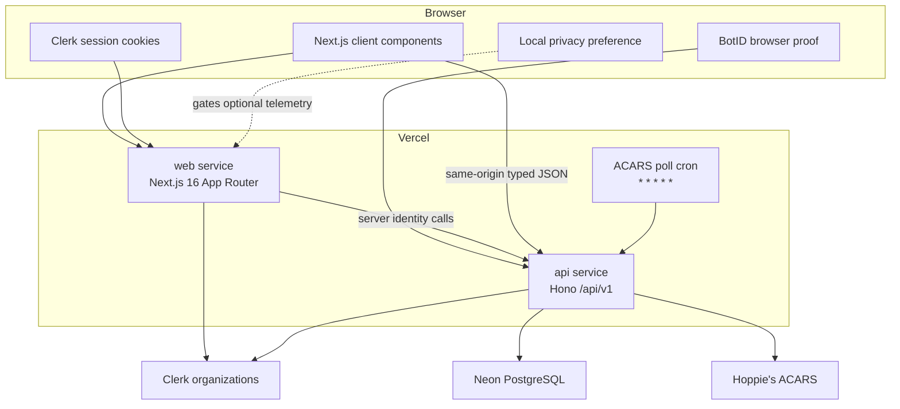
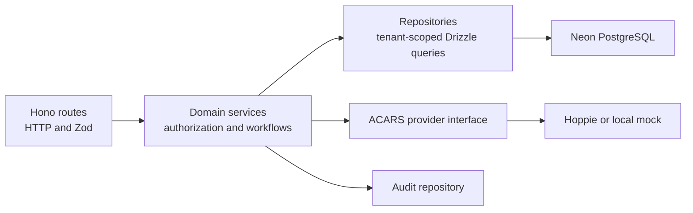

# Architecture

VA Dispatch is a TypeScript pnpm monorepo with two deployable applications and one shared lint package.

```text
apps/
├── api/                  Hono REST API, domain services, Drizzle repositories
└── web/                  Next.js App Router user interface
packages/
└── eslint-config/        Shared Next.js ESLint configuration
docs/                     Operational, privacy, and maintainer documents
wiki/                     Reviewable source mirror of this GitHub Wiki
vercel.ts                 Multi-service deployment and ACARS cron
```

## Runtime topology



`vercel.ts` routes `/api/*` to the API service and all other requests to the web service. It injects the API service URL into the web service as `API_INTERNAL_URL`. A two-project deployment is also supported by setting `API_ORIGIN` on the web project; the Next.js rewrite preserves same-origin browser calls.

## Web application layers

### Route and identity layer

The Next.js App Router uses a tenant segment at `/:slug`.

- The root layout owns public privacy controls and optional telemetry.
- The tenant layout configures Clerk's sign-in, sign-up, fallback, and task routes inside the current slug.
- The protected layout rejects unknown slugs, resolves identity, checks tenant agreement, and renders the shared application shell.
- Portal and dispatch layouts enforce the role-specific user experience.

`getServerIdentity()` performs the important three-way agreement:

1. URL tenant slug;
2. active Clerk organization slug; and
3. tenant returned by authenticated API calls.

No business data is requested until those values agree.

### Client data layer

Client components use TanStack Query for fetch state, caching, invalidation, and polling. `useApi()` obtains the current Clerk token and calls same-origin `/api/v1/*`. Every consumed response is parsed through a Zod schema in `apps/web/src/lib/api/schemas.ts`.

This means a successful HTTP response with a drifted shape fails as `INVALID_RESPONSE` rather than being trusted by the UI.

### Forms and UTC handling

React Hook Form and Zod validate schedule and flight forms. `datetime-local` values are deliberately interpreted as UTC rather than the browser's local timezone. Keep conversions inside `apps/web/src/lib/utc.ts`; do not use implicit `Date` parsing in forms.

## API application layers



### Middleware order

At the application level:

1. A request ID is accepted or generated and returned as `X-Request-Id`.
2. Security headers and configured CORS are applied.
3. Errors are normalized into the public JSON envelope.
4. Public docs and health routes are mounted.
5. Secret-authenticated internal routes are mounted before business middleware.
6. BotID protects browser mutations under the versioned business API.
7. Each route group authenticates with Clerk and applies role requirements.

### Route layer

Routes define method, path, Zod input contract, role middleware, response serialization, and status code. The versioned business API is mounted at both `/api/v1` and `/v1` because a service rewrite may strip the `/api` prefix.

### Domain layer

Domain services own workflow checks that do not belong in transport or SQL code:

- role checks;
- record ownership;
- schedule and flight state transitions;
- audit events;
- provider error translation; and
- cross-entity validation such as a linked flight's tenant.

### Repository layer

Repositories create tenant-scoped Drizzle queries. Tenant scoping is part of the repository or service call, not a UI filter. Cursor pagination uses `{createdAt, id}` encoded as base64url.

### Provider layer

The ACARS provider interface has Hoppie and DB-backed mock implementations. Production selection is fail-closed: it always resolves to Hoppie regardless of a stale `ACARS_PROVIDER=mock` value.

## Data and consistency model

The schema lives in `apps/api/src/db/schema.ts`. All operational tables carry `tenant_id`, and repository calls receive a tenant identifier from authenticated context.

The application currently uses the Neon HTTP driver. It does not maintain a persistent connection pool, supporting scale-to-zero operation. The repository has Drizzle generate/migrate scripts but no checked-in migration history at present; `db:push` is the documented bootstrap mechanism. See [Data Model](https://github.com/shiftbloom-studio/va-dispatcher/wiki/Data-Model) before changing schema behavior.

## Security boundaries

- **Identity boundary:** Clerk JWT and active organization claims.
- **Tenant boundary:** Clerk organization maps to exactly one database tenant; all reads and mutations scope by it.
- **Authorization boundary:** role hierarchy plus resource ownership checks.
- **Automation boundary:** BotID for browser mutations and `CRON_SECRET` for internal jobs.
- **Secret boundary:** tenant Hoppie logons encrypted with AES-256-GCM using `TENANT_SECRETS_KEY`.
- **Contract boundary:** Zod at API input and web response consumption.
- **Privacy boundary:** optional analytics is off until affirmative browser consent; legal pages are public and Clerk-free.

## Design decisions

### Path-based tenancy

The URL exposes the active Virtual Airline and lets branding, Clerk organization selection, and backend tenant identity be checked together. The backend is tenant-capable, but the current static web tenant registry contains only vSAS.

### Scale to zero

Neon HTTP, Vercel functions, and Clerk avoid an always-on application server. No Redis or external queue is required for the current workload. The one-minute Hoppie cron is the only regular production wake-up.

### Explicit state machines

Flights and schedule requests cannot jump arbitrarily between statuses. UI action matrices mirror backend transition tables. When adding a state, update schema enums, backend transitions and routes, serializers, frontend schemas, action matrices, views, OpenAPI, tests, and Wiki diagrams together.

### Store provider results only after acceptance

Outbound Hoppie messages are inserted only after a protocol-level `ok`. Provider failures return a sanitized error, retain the frontend draft, and are never retried automatically.

## Canonical code map

| Concern                  | Primary location                                                                                 |
| ------------------------ | ------------------------------------------------------------------------------------------------ |
| Database schema          | `apps/api/src/db/schema.ts`                                                                      |
| Authentication and roles | `apps/api/src/middleware/auth.ts`, `apps/api/src/domain/members/roles.ts`                        |
| BotID policy             | `apps/api/src/middleware/botid.ts`, `apps/web/src/instrumentation-client.ts`                     |
| Schedule workflows       | `apps/api/src/domain/schedule-requests/`                                                         |
| Flight workflows         | `apps/api/src/domain/flights/`                                                                   |
| Hoppie/provider behavior | `apps/api/src/acars/`, `apps/api/src/domain/acars/`                                              |
| HTTP contracts           | `apps/api/src/routes/`, `apps/api/src/docs/openapi.ts`                                           |
| Web response contracts   | `apps/web/src/lib/api/schemas.ts`                                                                |
| Tenant identity          | `apps/web/src/lib/server-identity.ts`                                                            |
| Legal/privacy controls   | `apps/web/src/lib/legal.ts`, `apps/web/src/lib/privacy-storage.ts`, `docs/privacy-compliance.md` |
| Deployment topology      | `vercel.ts`, `apps/web/next.config.ts`                                                           |
