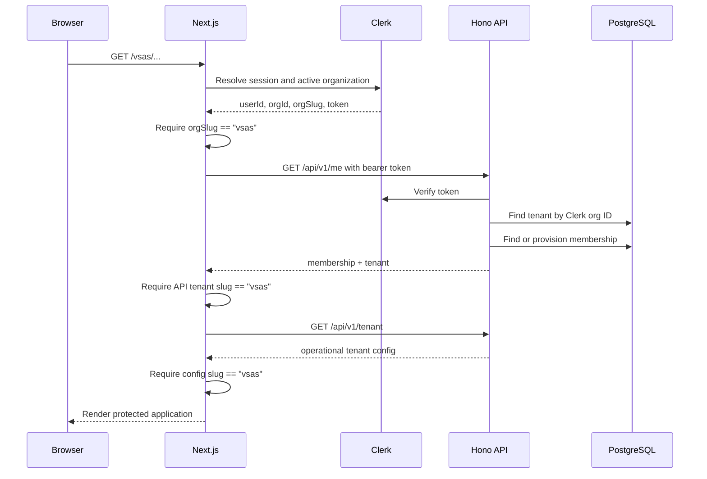
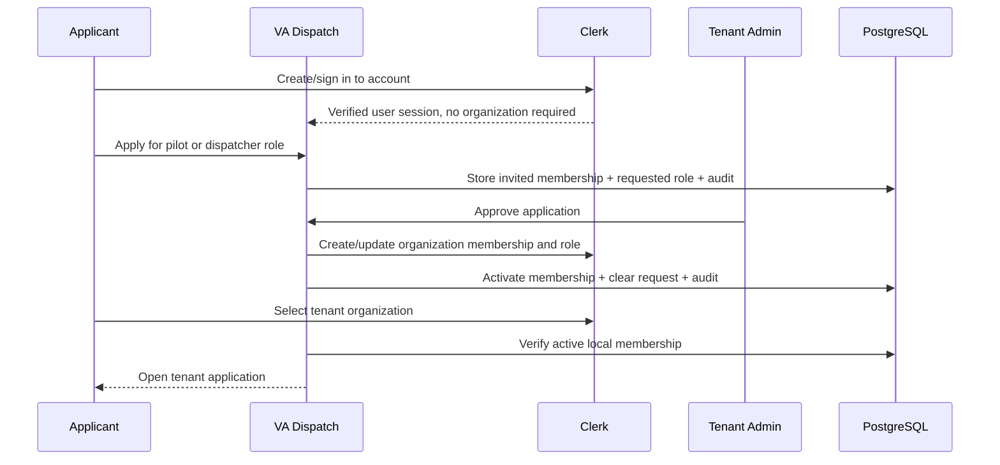

# Authentication and Multi-Tenancy

VA Dispatch uses Clerk Organizations as the identity-side representation of a Virtual Airline and a `tenants` row as the application-side representation. Every protected request resolves both before it can access business records.

## Tenant identity chain



The web application makes no business-data reads if the URL, active Clerk organization, `/me` tenant, and `/tenant` result do not agree.

## API authentication

Production requests use:

```http
Authorization: Bearer <Clerk session JWT>
```

The API verifies the token with `CLERK_SECRET_KEY` and requires:

- a subject (`sub`);
- an active organization ID from the standard or compact Clerk claim;
- a database tenant mapped to that organization; and
- an active local membership.

The narrow `GET|POST|DELETE /membership-application` flow is the exception to
the organization requirement. It still verifies the Clerk session subject, but
resolves the requested tenant from the server-known URL slug and never accepts
a tenant ID or user ID from the browser. It exposes no operational data and
marks every response `private, no-store`.

The configured `VSAS_CLERK_ORG_ID` is a narrow bootstrap exception: if that exact organization is missing from the database, the API can create or repair the tenant with slug `vsas`. Arbitrary organizations are never auto-created as tenants.

## Membership provisioning and roles

On first access to a registered tenant, the API atomically creates an active
pilot or dispatcher membership, using the role assigned through the native
tenant administration flow, plus a self-provision audit event. A Clerk admin
claim does not grant routine application-admin privilege during authentication.
Admin authority comes from the audited VA Dispatch control plane. The only
recovery exception promotes a verified Clerk organization admin when the
tenant has no active application administrator.

Clerk directory role keys are normalized by removing `org:` and mapping:

```text
admin / owner  -> admin
dispatcher     -> dispatcher
pilot / member -> pilot
unknown        -> pilot
```

Role rank is hierarchical:

```text
pilot = 1, dispatcher = 2, admin = 3
```

`requireRole("dispatcher")` therefore permits dispatchers and administrators. `requireRole("admin")` permits administrators only.

The stored local membership role and status are authoritative after
provisioning. Active role changes are synchronized to Clerk before the local
change commits. A disabled or pending local membership is never reactivated
merely because a stale Clerk organization membership exists.

The native tenant administration flow provides:

- direct pilot/dispatcher invitations through Clerk email;
- pilot/dispatcher applications from signed-in users with manual admin review;
- application approval, which creates or updates Clerk organization membership
  before local access becomes active;
- rejection without granting Clerk membership;
- role/status changes with existing assigned-work and last-admin guards;
- member removal, which disables local access first and then removes Clerk
  membership, returning an explicit retry state if Clerk is unavailable; and
- `/members/sync`, an admin-only, fully paged reconciliation tool with explicit
  partial-failure reporting.

Membership statuses are:

- `active`: may authenticate;
- `invited`: rejected by the API until activated; and
- `disabled`: rejected by the API.

For self-service signup, `invited` means a pending application and `role`
records the requested pilot/dispatcher role. Approval activates that role;
rejection closes the request atomically. A returning disabled member may apply
again, but still needs another explicit decision.

## Signup and approval sequence



Direct invitations skip the application decision: Clerk sends the invitation
and the accepted organization role is provisioned on first tenant access.

## Resource authorization

Tenant isolation and role authorization are separate checks.

| Resource                 | Pilot visibility    | Dispatcher/admin visibility      |
| ------------------------ | ------------------- | -------------------------------- |
| Schedule requests        | Own membership only | All records in active tenant     |
| Flights                  | Assigned pilot only | All records in active tenant     |
| Members                  | No list access      | All memberships in active tenant |
| Dispatch board and inbox | None                | Active tenant only               |
| ACARS messages           | None                | Active tenant only               |
| Tenant details           | Current tenant      | Current tenant                   |

Pilot decisions also check ownership of the individual flight. All repository calls include the authenticated tenant ID; UUID knowledge alone does not grant cross-tenant access.

## Static web tenants and database tenants

The backend schema and API are tenant-scoped, but `apps/web/src/lib/tenant.ts` currently contains one static branding entry: `vsas`.

Adding another Virtual Airline requires all of the following:

1. Add and test its static web tenant configuration and brand assets.
2. Create a Clerk organization with the matching slug.
3. Create the database tenant mapping to that Clerk organization ID.
4. Configure legal/operator implications for the deployment.
5. Configure a distinct Hoppie ground station if ACARS is used.
6. Add tenant-isolation tests covering the new path.

Creating only a database row is not enough; the web rejects unknown URL slugs before loading identity.

## Development authentication bypass

When `AUTH_DEV_BYPASS=true` and `NODE_ENV` is not `production`, the API accepts:

```http
X-Dev-User-Id: user_dev
X-Dev-Org-Id: org_vsas_dev
X-Dev-Role: admin
```

Defaults are supplied for missing headers, but the referenced tenant must already exist. The bypass upserts a development membership and uses its stored role.

The bypass is hard-disabled in production. It must still never be configured there.

The fast browser suite uses `NEXT_PUBLIC_E2E_ROUTE_FIXTURE_MODE`; the integrated
suite uses `E2E_FIXTURE_MODE`, a high-entropy `E2E_FIXTURE_SECRET`, an exact
disposable-database confirmation, and `NEXT_PUBLIC_E2E_FIXTURE_MODE`. All
fixture modes are rejected in production and are not deployment authentication.

## Clerk-free public routes

The following paths intentionally bypass Clerk middleware:

- `/impressum`
- `/imprint` (redirect)
- `/privacy`
- `/datenschutz` (redirect)

This lets visitors review legal and privacy information before loading authentication code. Health and API documentation are public at the API service; business API routes remain authenticated.

## BotID is not authentication

BotID runs before authenticated business routes on mutating requests. It is an abuse-control layer, not an identity or role substitute. A request must pass BotID where applicable and then pass Clerk authentication, tenant resolution, and authorization.

Internal cron routes are excluded from BotID because they use `CRON_SECRET`.
Development seed and integrated fixture routes are independently hard-disabled
in production and use separate non-production authority.

## Invariants for contributors

- Never infer tenant from an untrusted body, query parameter, or resource ID.
- Derive it from authenticated context and include it in every repository predicate.
- Do not load business data before the web tenant agreement check completes.
- Keep role mapping conservative; unknown Clerk roles remain pilots.
- Keep Clerk automatic organization creation, Verified Domain auto-enrollment,
  and native membership-request flows disabled for this deployment; VA
  Dispatch owns the manual approval state.
- Test both unauthorized role access and cross-tenant UUID access for new resources.
- Do not return Clerk secrets, Hoppie credentials, or encrypted values in serializers.
