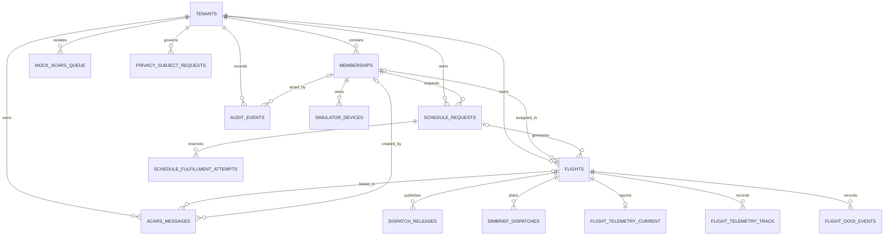

# Data Model

The canonical schema is `apps/api/src/db/schema.ts`, implemented with Drizzle ORM for PostgreSQL. UUID primary keys are generated in the database, and timestamps use timezone-aware PostgreSQL values.

## Entity relationship overview



All operational tables include `tenant_id`. Tenant selection comes from authenticated context, never from a request body.

## Tables

### `tenants`

One row per Virtual Airline.

| Important field    | Purpose                                                                         |
| ------------------ | ------------------------------------------------------------------------------- |
| `slug`             | Unique URL/application tenant key                                               |
| `name`             | Operational display name                                                        |
| `clerk_org_id`     | Unique Clerk organization mapping                                               |
| `hoppie_station`   | Shared ground-station callsign                                                  |
| `hoppie_logon_enc` | AES-256-GCM encrypted Hoppie logon                                              |
| `settings`         | Flexible JSON settings, including ACARS test metadata and `memberAccess` policy |

Deleting a tenant cascades to all tenant-owned operational tables. No application endpoint currently deletes tenants.

### `memberships`

Tenant-local user profile and authorization record.

| Important field                            | Purpose                                                                           |
| ------------------------------------------ | --------------------------------------------------------------------------------- |
| `clerk_user_id`                            | Clerk identity inside tenant                                                      |
| `role`                                     | `pilot`, `dispatcher`, or `admin`; for an invited application, the requested role |
| `display_name`                             | Optional tenant display name                                                      |
| `pilot_callsign`                           | Optional personal aircraft ACARS callsign                                         |
| `simbrief_user_id`, `simbrief_verified_at` | Pilot-owned SimBrief link                                                         |
| `navigraph_subject`, `navigraph_username`  | Navigraph OAuth identity                                                          |
| `status`                                   | `active`, `invited`, or `disabled`                                                |

`(tenant_id, clerk_user_id)` and `(tenant_id, pilot_callsign)` are unique. PostgreSQL permits multiple null callsigns. Schedule requests restrict membership deletion; flight and audit actor links use set-null behavior.

The application reuses the membership lifecycle instead of creating a second
applicant identity store: `invited` plus the membership `role` is pending,
`active` is approved, and `disabled` is rejected, cancelled, or removed. The
verified Clerk user ID remains the unique identity inside a tenant. Application
submission, cancellation, approval, rejection, and safe removal each write the
membership change and its local security audit atomically.

### `schedule_requests`

Pilot demand and availability history.

| Important field                  | Purpose                                                  |
| -------------------------------- | -------------------------------------------------------- |
| `pilot_membership_id`            | Required request owner                                   |
| `window_start`, `window_end`     | Overall UTC envelope                                     |
| `desired_flight_count`           | Requested count                                          |
| `preferences`                    | Flexible JSON, currently detailed availability intervals |
| `version`                        | Optimistic-concurrency revision                          |
| `status`                         | Request lifecycle                                        |
| `reject_reason`, `cancel_reason` | Terminal explanations                                    |

Rows are indexed by tenant/status and tenant/pilot. Membership deletion is restricted while a request references it.

### `flights`

Canonical dispatch and operational record.

| Important field                         | Purpose                                            |
| --------------------------------------- | -------------------------------------------------- |
| `schedule_request_id`                   | Optional origin; set null if request is deleted    |
| `replaces_flight_id`                    | Optional immutable declined source                 |
| `pilot_membership_id`                   | Optional assignment; set null if member is deleted |
| `flight_number`, `dep_icao`, `arr_icao` | Route identity                                     |
| `etd`, `eta`, `aircraft_type`           | Planned schedule/equipment                         |
| `status`                                | Flight lifecycle                                   |
| `version`, assignment revisions         | Concurrency and pilot-confirmation state           |
| `cancel_reason`, `declined_reason`      | Terminal explanations                              |
| `dispatcher_notes`                      | Free-text briefing/context                         |
| `out_at`, `off_at`, `on_at`, `in_at`    | OOOI timestamps                                    |
| manual-override flags                   | Prevent automatic overwrite of corrections         |

Indexes support tenant status, tenant ETD, tenant pilot, and schedule-request lookup.

### Dispatch planning and fulfillment

- `dispatch_releases` stores immutable, numbered route/weather/fuel/payload and
  dispatcher-attribution snapshots.
- `simbrief_dispatches` stores prepared/pending/ready revisions, immutable
  flight/release snapshots, callback expiry, request, OFP, and trusted actors.
- `simbrief_flight_heads` is the per-flight compare-and-set revision head.
- `schedule_fulfillment_attempts` stores the tenant/request/idempotency key,
  canonical payload hash, ordered flight IDs, and immutable request outcome.

### Simulator telemetry and OOOI

- `simulator_devices` stores pilot-owned device identity, token MAC, revocation,
  and sequence/last-seen state; raw bearer tokens are never stored.
- `flight_telemetry_leases` prevents two devices claiming one flight.
- `flight_telemetry_current` stores the newest trusted sample per flight.
- `flight_telemetry_track` stores a bounded recent position history.
- `flight_oooi_events` records append-only automatic/manual OOOI provenance.

### `acars_messages`

Stored inbound and accepted outbound ACARS traffic.

| Important field                      | Purpose                                                    |
| ------------------------------------ | ---------------------------------------------------------- |
| `direction`                          | `inbound` or `outbound`                                    |
| `msg_type`                           | `telex`, `progress`, `cpdlc`, `position`, or `other`       |
| `from_station`, `to_station`, `body` | Operational message                                        |
| `hoppie_raw`                         | Raw provider metadata/response                             |
| `provider`                           | `mock` or `hoppie`                                         |
| `provider_message_id`                | Provider deduplication identity                            |
| `delivery_status`                    | Outbound `pending`, `accepted`, `rejected`, or `ambiguous` |
| `flight_id`                          | Optional link; set null with flight deletion               |
| `created_by_membership_id`           | Optional outbound actor                                    |
| `received_at`, `sent_at`             | Direction-specific provider time                           |

`(tenant_id, provider, provider_message_id)` is unique for deduplication. Null provider IDs are allowed for Hoppie outbound sends that do not return a stable ID.

### `audit_events`

Append-only application action record containing actor, action string, entity type/ID, JSON metadata, and timestamp. It is indexed by tenant/time and entity.

Administrators can filter the audit viewer and perform a bounded, access-audited
export. Treat it as operational evidence, not an immutable security ledger.

### Privacy lifecycle

`privacy_policies`, `privacy_retention_runs`, `privacy_subject_requests`,
`privacy_subject_controls`, `privacy_legal_holds`, and
`privacy_external_tasks` implement approved, resumable retention and subject
operations without claiming control over external provider data or backups.

### `mock_acars_queue`

Local/test-only queue for simulated inbound messages and mock acknowledgements. A delivery timestamp marks drained rows. Production policy never selects this provider.

## Enums

### Member role

```text
pilot | dispatcher | admin
```

### Member status

```text
active | invited | disabled
```

The public application contract accepts only `pilot | dispatcher`; an
application cannot request the tenant-admin role.

### Schedule request status

```text
pending | in_review | fulfilled | partially_fulfilled | rejected | cancelled
```

### Flight status

```text
draft | offered | accepted | declined | briefed | active | completed | cancelled
```

### ACARS

```text
direction: inbound | outbound
type: telex | progress | cpdlc | position | other
provider: mock | hoppie
delivery: pending | accepted | rejected | ambiguous
```

## Deletion and retention

Cancellation preserves operational history. The privacy control plane supports
approved dry-run/execute retention, verified export, correction, restriction,
objection, anonymization/erasure, holds, and auditable external-provider tasks.
Operators still define the lawful policy and complete Clerk, Vercel, Neon,
Hoppie, backup, and legal work that the application cannot perform itself.

Free-text fields—including notes, rejection/cancellation reasons, ACARS bodies, audit metadata, and settings JSON—can contain personal data even when the schema does not require it.

## Schema deployment status

The repository exposes:

```bash
pnpm db:push
pnpm db:studio
```

`apps/api/src/db/schema.ts` is canonical. This Shiftbloom project is
pre-production. Preview and Production deployments run `pnpm db:push` from the
exact release commit during the API service's Vercel build, before the new
application is promoted. Deployment uses Drizzle's machine-readable output
mode and deliberately omits the data-loss `--force` option, so a destructive or
ambiguous proposal exits with missing hints and fails closed.

For a schema change:

1. Update `schema.ts`.
2. Apply the schema to a disposable database with `db:push` and keep deployed
   changes additive and backward-compatible.
3. Update repositories, services, serializers, OpenAPI, web schemas, and tests.
4. Run the real PostgreSQL contracts against that fresh schema.
5. Before making an incompatible change to a catalog with durable data, stop
   and adopt reviewed migrations, compatibility sequencing, and rollback.

## Model boundaries

- Browser analytics preference is intentionally local-only and versioned in
  browser storage; it is not a server consent ledger.
- Free-text and provider payloads may contain personal data even when the schema
  does not require it.
- Audit evidence is append-oriented and access-controlled but not externally
  tamper-evident.
- External provider and backup completion remains a tracked operator task, not
  a claim that the database deleted third-party copies.
