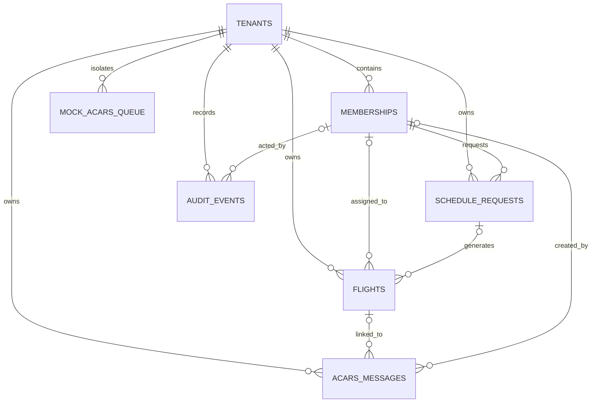

# Data Model

The canonical schema is `apps/api/src/db/schema.ts`, implemented with Drizzle ORM for PostgreSQL. UUID primary keys are generated in the database, and timestamps use timezone-aware PostgreSQL values.

## Entity relationship overview



All operational tables include `tenant_id`. Tenant selection comes from authenticated context, never from a request body.

## Tables

### `tenants`

One row per Virtual Airline.

| Important field    | Purpose                                                         |
| ------------------ | --------------------------------------------------------------- |
| `slug`             | Unique URL/application tenant key                               |
| `name`             | Operational display name                                        |
| `clerk_org_id`     | Unique Clerk organization mapping                               |
| `hoppie_station`   | Shared ground-station callsign                                  |
| `hoppie_logon_enc` | AES-256-GCM encrypted Hoppie logon                              |
| `settings`         | Flexible JSON settings, currently including ACARS test metadata |

Deleting a tenant cascades to all tenant-owned operational tables. No application endpoint currently deletes tenants.

### `memberships`

Tenant-local user profile and authorization record.

| Important field  | Purpose                                   |
| ---------------- | ----------------------------------------- |
| `clerk_user_id`  | Clerk identity inside tenant              |
| `role`           | `pilot`, `dispatcher`, or `admin`         |
| `display_name`   | Optional tenant display name              |
| `pilot_callsign` | Optional personal aircraft ACARS callsign |
| `status`         | `active`, `invited`, or `disabled`        |

`(tenant_id, clerk_user_id)` and `(tenant_id, pilot_callsign)` are unique. PostgreSQL permits multiple null callsigns. Schedule requests restrict membership deletion; flight and audit actor links use set-null behavior.

### `schedule_requests`

Pilot demand and availability history.

| Important field              | Purpose                                                  |
| ---------------------------- | -------------------------------------------------------- |
| `pilot_membership_id`        | Required request owner                                   |
| `window_start`, `window_end` | Overall UTC envelope                                     |
| `desired_flight_count`       | Requested count                                          |
| `preferences`                | Flexible JSON, currently detailed availability intervals |
| `status`                     | Request lifecycle                                        |
| `reject_reason`              | Optional dispatcher explanation                          |

Rows are indexed by tenant/status and tenant/pilot. Membership deletion is restricted while a request references it.

### `flights`

Canonical dispatch and operational record.

| Important field                         | Purpose                                            |
| --------------------------------------- | -------------------------------------------------- |
| `schedule_request_id`                   | Optional origin; set null if request is deleted    |
| `pilot_membership_id`                   | Optional assignment; set null if member is deleted |
| `flight_number`, `dep_icao`, `arr_icao` | Route identity                                     |
| `etd`, `eta`, `aircraft_type`           | Planned schedule/equipment                         |
| `status`                                | Flight lifecycle                                   |
| `cancel_reason`, `declined_reason`      | Terminal explanations                              |
| `dispatcher_notes`                      | Free-text briefing/context                         |
| `out_at`, `off_at`, `on_at`, `in_at`    | Nullable OOOI placeholders                         |

Indexes support tenant status, tenant ETD, tenant pilot, and schedule-request lookup.

### `acars_messages`

Stored inbound and accepted outbound ACARS traffic.

| Important field                      | Purpose                                              |
| ------------------------------------ | ---------------------------------------------------- |
| `direction`                          | `inbound` or `outbound`                              |
| `msg_type`                           | `telex`, `progress`, `cpdlc`, `position`, or `other` |
| `from_station`, `to_station`, `body` | Operational message                                  |
| `hoppie_raw`                         | Raw provider metadata/response                       |
| `provider`                           | `mock` or `hoppie`                                   |
| `provider_message_id`                | Provider deduplication identity                      |
| `flight_id`                          | Optional link; set null with flight deletion         |
| `created_by_membership_id`           | Optional outbound actor                              |
| `received_at`, `sent_at`             | Direction-specific provider time                     |

`(tenant_id, provider, provider_message_id)` is unique for deduplication. Null provider IDs are allowed for Hoppie outbound sends that do not return a stable ID.

### `audit_events`

Append-only application action record containing actor, action string, entity type/ID, JSON metadata, and timestamp. It is indexed by tenant/time and entity.

The current application writes audit events for key mutations but exposes no audit-query API or UI. Treat it as an implementation audit trail, not a complete compliance or immutable security ledger.

### `mock_acars_queue`

Local/test-only queue for simulated inbound messages and mock acknowledgements. A delivery timestamp marks drained rows. Production policy never selects this provider.

## Enums

### Member role

```text
pilot | dispatcher | admin
```

### Member status

```text
active | invited | disabled
```

### Schedule request status

```text
pending | in_review | fulfilled | partially_fulfilled | rejected | cancelled
```

### Flight status

```text
draft | offered | accepted | declined | briefed | active | completed | cancelled
```

### ACARS

```text
direction: inbound | outbound
type: telex | progress | cpdlc | position | other
provider: mock | hoppie
```

## Deletion and retention

The schema defines relational deletion behavior, but the application has no general delete/export/anonymize API for operational records. Request and flight cancellation preserve history. Operators must define and implement legally appropriate retention, data-subject request, backup, and deletion procedures outside the current product surface.

Free-text fields—including notes, rejection/cancellation reasons, ACARS bodies, audit metadata, and settings JSON—can contain personal data even when the schema does not require it.

## Schema deployment status

The repository exposes:

```bash
pnpm db:generate
pnpm db:migrate
pnpm db:push
```

No Drizzle migration history is checked in at present. The documented bootstrap flow uses `db:push`. Before the first production schema evolution, establish and review a forward/rollback migration policy rather than relying on an unreviewed direct push.

For a schema change:

1. Update `schema.ts`.
2. Decide explicitly whether the change is compatible with existing data.
3. Generate and review migration SQL if migration history is being introduced.
4. Update repositories, services, serializers, OpenAPI, web schemas, and tests.
5. Plan rollout and rollback before touching a shared database.

## Current model gaps

There are no tables for:

- SimBrief/Navigraph identity, OFP, or flight-plan revisions;
- aircraft telemetry or position history;
- idempotent dispatch-generation batches;
- optimistic record versions;
- consent records in the server database; or
- configured retention/deletion jobs.

The browser analytics preference is intentionally local-only and versioned in browser local storage.
