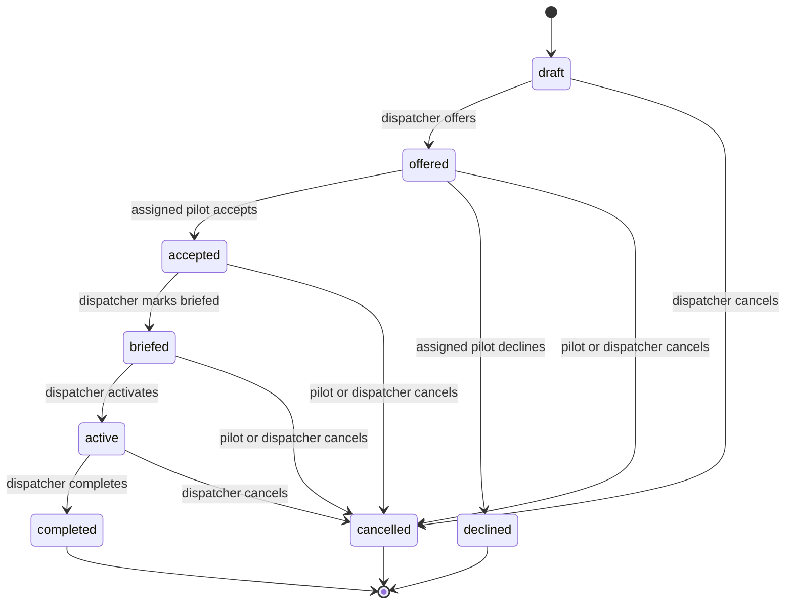

# Flights and State Machines

A flight is the canonical operational record used by pilots, dispatchers, the operations board, and optional ACARS links.

## Flight fields

| Group             | Fields                                                        |
| ----------------- | ------------------------------------------------------------- |
| Identity          | `id`, `tenantId`, optional `scheduleRequestId`                |
| Assignment        | optional `pilotMembershipId`                                  |
| Route             | `flightNumber`, `depIcao`, `arrIcao`, optional `aircraftType` |
| Schedule          | `etd`, `eta`                                                  |
| Lifecycle         | `status`, optional cancel and decline reasons                 |
| Dispatch          | optional `dispatcherNotes`                                    |
| OOOI placeholders | `outAt`, `offAt`, `onAt`, `inAt`                              |
| Record history    | `createdAt`, `updatedAt`                                      |

ICAO fields are normalized to uppercase by the repository. Web forms also uppercase flight number and aircraft type before submission.

## State machine

`declined`, `completed`, and `cancelled` are terminal in the current transition table.

## Action matrix

| Status      | Pilot web actions | Dispatcher/admin web actions |
| ----------- | ----------------- | ---------------------------- |
| `draft`     | None              | Edit, offer, cancel          |
| `offered`   | Accept, decline   | Edit, cancel                 |
| `accepted`  | Cancel            | Edit, mark briefed, cancel   |
| `briefed`   | Cancel            | Edit, activate, cancel       |
| `active`    | None              | Edit, complete, cancel       |
| `declined`  | Read only         | Read only                    |
| `completed` | Read only         | Read only                    |
| `cancelled` | Read only         | Read only                    |

The backend also allows an assigned pilot to cancel an offered flight, although the pilot UI presents accept or decline for that state.

## Authorization

- Pilots can list and retrieve only flights assigned to their membership.
- Only the assigned pilot can accept or decline.
- Pilots can cancel their own flight before it becomes active.
- Dispatchers and administrators can see all flights inside the active tenant.
- Offering, briefing, activation, completion, and dispatcher edits require dispatcher role or higher.
- Every lookup includes tenant ID; a valid UUID from another tenant is not sufficient.

## Creating flights

### Schedule offer

`POST /flights/bulk` creates offered flights linked to one schedule request. The normal UI submits exactly the requested number and assigns the request's pilot.

### Ad-hoc flight

`POST /flights` creates a draft or offered flight with no required schedule request. The UI requires a pilot for an immediate offer and permits an unassigned draft.

Before offering a draft, dispatch should ensure the pilot assignment is valid and active. The current API does not independently validate the referenced membership's tenant, role, or status at creation time; web clients select from the tenant's active pilot list.

## Editing

Dispatchers can edit non-terminal flights:

- pilot assignment;
- flight number;
- route;
- ETD and ETA;
- aircraft type; and
- dispatcher notes.

Completed and cancelled records cannot be edited. Declined records are terminal in the state machine but are not included in the backend's edit prohibition; the current UI action matrix makes them read-only.

Current edits are last-write-wins. The API has no record version, `If-Match`, or compare-and-set contract. It also does not automatically reset acceptance after a material reassignment or schedule change. Concurrent-editor and reassignment semantics should be designed before expanding collaborative dispatch editing.

## Cancelling

A cancellation may include a reason. Cancellation preserves the record and its links.

Cancelling a flight does not change its originating schedule request. Cancelling a schedule request does not change the flight. This non-cascading behavior is intentionally visible in confirmation copy.

## Operations board

The dispatcher board contains flights that:

- belong to the active tenant;
- have status `offered`, `accepted`, `briefed`, or `active`; and
- have an ETD no later than seven days from the current time.

It groups by status and refreshes every 10 seconds. There is currently no lower ETD bound, so an old non-terminal record can remain visible until its status is corrected.

The dashboard's **Active pilots** metric counts memberships with role `pilot` and status `active`. It is not a count of airborne, connected, or recently-seen pilots.

## Pilot dashboard visibility

The pilot dashboard shows:

- `offered` flights in **Flight offers**;
- `accepted` and `briefed` flights in **Upcoming flights**; and
- `completed`, `cancelled`, and `declined` flights in recent history.

An `active` flight remains available through its direct detail URL and API assignment, but the current pilot dashboard does not place it in one of those groups.

## OOOI and monitoring

The schema contains nullable Out, Off, On, and In timestamps, but the current application has no simulator ingestion endpoint, automatic phase detection, telemetry table, live map, or OOOI editor. Flight activation and completion are manual dispatcher transitions.

Inbound ACARS `progress` and `position` messages are stored as typed message records, but their bodies are not parsed into flight telemetry or OOOI fields.

Do not describe the current operations board as live aircraft monitoring. See [Project Status and Limitations](https://github.com/shiftbloom-studio/va-dispatcher/wiki/Project-Status-and-Limitations).

## Pagination and ordering

The flight list is cursor-paginated with a maximum page size of 100. Records are ordered by descending ETD and ID, while the opaque cursor is derived from creation time and ID. Consumers must treat `nextCursor` as opaque and send it back unchanged.

## Extending the lifecycle safely

Adding dispatch release, SimBrief readiness, boarding, delayed, diverted, or telemetry-driven states is a cross-layer change. Update:

1. PostgreSQL enum and migration strategy.
2. Backend transition table and role/ownership rules.
3. Route validation and OpenAPI.
4. Web Zod schema and status presentation.
5. Pilot and dispatcher action matrices.
6. Dashboard groupings and filters.
7. Audit events and cancellation semantics.
8. Unit, authorization, isolation, component, and browser tests.

Avoid using a flight status as a proxy for data that deserves its own lifecycle, such as flight-plan generation or ACARS delivery.
