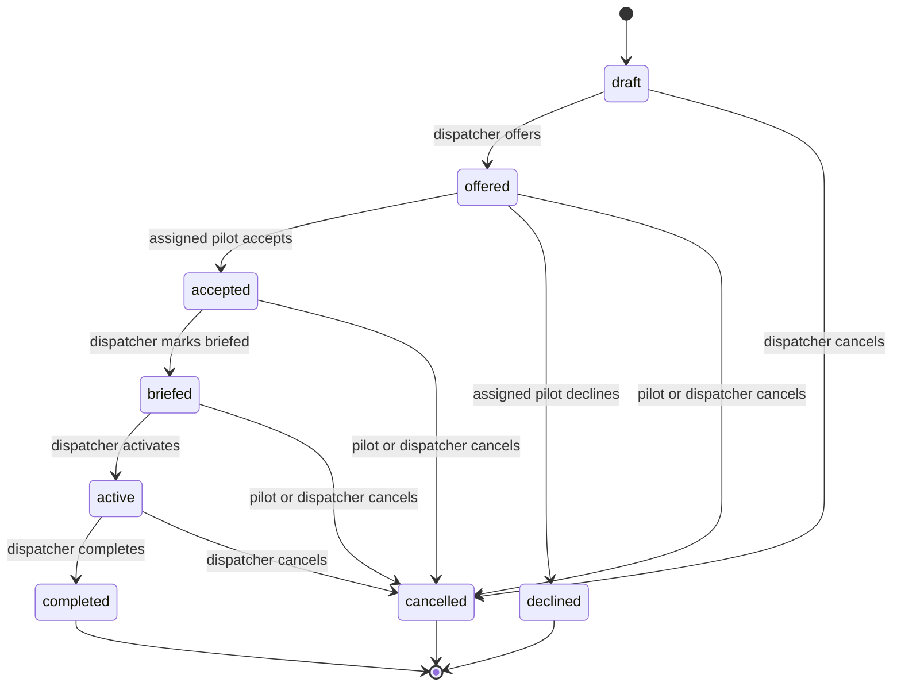

# Flights and State Machines

A flight is the canonical operational record used by pilots, dispatchers, the operations board, and optional ACARS links.

## Flight fields

| Group          | Fields                                                                        |
| -------------- | ----------------------------------------------------------------------------- |
| Identity       | `id`, `tenantId`, optional `scheduleRequestId`, optional `replacesFlightId`   |
| Assignment     | optional `pilotMembershipId`, assignment and confirmation revisions           |
| Route          | `flightNumber`, `depIcao`, `arrIcao`, optional `aircraftType`                 |
| Schedule       | `etd`, `eta`                                                                  |
| Lifecycle      | numeric `version`, `status`, optional cancel and decline reasons              |
| Dispatch       | optional `dispatcherNotes`, immutable dispatch-release revisions              |
| OOOI           | `outAt`, `offAt`, `onAt`, `inAt`, manual-override flags and provenance events |
| Record history | `createdAt`, `updatedAt`                                                      |

ICAO fields are normalized to uppercase by the repository. Web forms also uppercase flight number and aircraft type before submission.

## State machine

`declined`, `completed`, and `cancelled` are terminal in the current transition table.

## Action matrix

| Status      | Pilot web actions | Dispatcher/admin web actions |
| ----------- | ----------------- | ---------------------------- |
| `draft`     | None              | Edit, offer, cancel          |
| `offered`   | Accept, decline   | Edit, cancel                 |
| `accepted`  | Cancel            | Edit, mark briefed, cancel   |
| `briefed`   | Cancel            | Edit, activate, cancel       |
| `active`    | None              | Complete, cancel             |
| `declined`  | Read only         | Create one replacement offer |
| `completed` | Read only         | Read only                    |
| `cancelled` | Read only         | Read only                    |

The backend also allows an assigned pilot to cancel an offered flight, although the pilot UI presents accept or decline for that state.

## Authorization

- Pilots can list and retrieve only flights assigned to their membership.
- Only the assigned pilot can accept or decline.
- Pilots can cancel their own flight before it becomes active.
- Dispatchers and administrators can see all flights inside the active tenant.
- Offering, briefing, activation, completion, and dispatcher edits require dispatcher role or higher.
- Every lookup includes tenant ID; a valid UUID from another tenant is not sufficient.

## Creating flights

### Schedule offer

`POST /flights/bulk` creates an atomic batch of offered flights linked to one
schedule request. It requires the current request version and an
`Idempotency-Key`, respects cumulative remaining capacity, and assigns the
request's active pilot.

### Ad-hoc flight

`POST /flights` creates only an ad-hoc draft or offer. A draft may be unassigned;
an offer requires a same-tenant active pilot. The API validates pilot role,
status, tenant, ETA after ETD, and any applicable availability rule.

## Editing

Dispatchers can version-edit eligible non-terminal flights:

- pilot assignment;
- flight number;
- route;
- ETD and ETA;
- aircraft type; and
- dispatcher notes.

Completed, cancelled, declined, and materially active records are immutable.
Every mutation compares the numeric version and returns the latest record on a
conflict. Material pilot, route, schedule, equipment, or flight-number changes
require a reason and invalidate acceptance/planning state; notes-only edits do
not. Mutation and audit are one database statement.

A declined flight stays terminal. Dispatch may create one replacement that
copies its immutable source data and links through `replacesFlightId`.
Concurrent attempts converge on one winning replacement.

## Cancelling

A cancellation may include a reason. Cancellation preserves the record and its links.

Cancelling an individual flight preserves its originating request link.
Cancelling a request separately requires an explicit policy to keep linked
flights or cancel eligible pre-departure flights atomically.

## Operations board

The dispatcher board contains same-tenant accepted and briefed flights from 24
hours overdue through seven days ahead, every active flight regardless of ETD,
and completed flights from the current UTC month. Offered flights remain in
Flight Management. The server classifies overdue, accepted, briefed, active,
and completed lanes and the UI refreshes every 10 seconds.

Pilot-presence metrics use each pilot's newest trusted simulator receipt and
distinguish online, airborne, and stale presence. They do not count all active
memberships.

## Pilot dashboard visibility

The pilot dashboard shows:

- `offered` flights in **Flight offers**;
- `accepted` and `briefed` flights in **Upcoming flights**; and
- `active` flights in their own active group, regardless of old ETD; and
- `completed`, `cancelled`, and `declined` flights in recent history.

## OOOI and monitoring

Pilots issue revocable simulator-device tokens and the MSFS client sends
sequence-checked position/phase samples. The API stores a current sample and a
bounded track, derives live presence, and may record automatic Out, Off, On,
and In events. Dispatch can correct OOOI timestamps manually with a reason.
Source/device/actor provenance is append-only and each accepted OOOI mutation
increments the flight version atomically.

ACARS message text is not treated as simulator telemetry. The monitoring UI is
for virtual-airline operational awareness, not real-world navigation.

## Pagination and ordering

The flight list is cursor-paginated with a maximum page size of 100. Ordering
and seek use `(etd DESC, id DESC)`. Cursors are strict, versioned, and opaque;
reuse them only with the same filters. Legacy or malformed cursors are rejected.

## Extending the lifecycle safely

Adding boarding, delayed, diverted, or another lifecycle is a cross-layer change. Update:

1. PostgreSQL enum and fresh-schema rollout.
2. Backend transition table and role/ownership rules.
3. Route validation and OpenAPI.
4. Web Zod schema and status presentation.
5. Pilot and dispatcher action matrices.
6. Dashboard groupings and filters.
7. Audit events and cancellation semantics.
8. Unit, authorization, isolation, component, and browser tests.

Avoid using a flight status as a proxy for data that deserves its own lifecycle, such as flight-plan generation or ACARS delivery.
