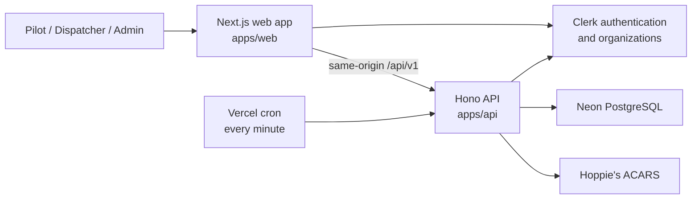

# VA Dispatch Wiki

VA Dispatch is a multi-tenant virtual-airline operations application. It gives pilots a schedule and flight-offer portal, gives dispatchers a live operations workspace and ACARS station, and gives administrators tenant and Hoppie configuration controls.

The current deployment is branded for **vSAS** at `/vsas`, while the API and database isolate records by Virtual Airline tenant.

> **Simulation only:** VA Dispatch supports virtual-flight operations. It is not an aviation safety, navigation, or real-world operational system. All displayed and entered times are UTC / Zulu.

## Start here

| I want to…                                             | Read                                                                                                                     |
| ------------------------------------------------------ | ------------------------------------------------------------------------------------------------------------------------ |
| Understand what pilots, dispatchers, and admins can do | [Product and Role Guide](https://github.com/shiftbloom-studio/va-dispatcher/wiki/Product-and-Role-Guide)                 |
| Run the project locally                                | [Local Development](https://github.com/shiftbloom-studio/va-dispatcher/wiki/Local-Development)                           |
| Configure a deployment                                 | [Configuration Reference](https://github.com/shiftbloom-studio/va-dispatcher/wiki/Configuration-Reference)               |
| Understand the system design                           | [Architecture](https://github.com/shiftbloom-studio/va-dispatcher/wiki/Architecture)                                     |
| Work on schedule and dispatch behavior                 | [Scheduling and Dispatch](https://github.com/shiftbloom-studio/va-dispatcher/wiki/Scheduling-and-Dispatch)               |
| Work on flight lifecycle behavior                      | [Flights and State Machines](https://github.com/shiftbloom-studio/va-dispatcher/wiki/Flights-and-State-Machines)         |
| Configure or troubleshoot Hoppie                       | [ACARS and Hoppie](https://github.com/shiftbloom-studio/va-dispatcher/wiki/ACARS-and-Hoppie)                             |
| Integrate with the REST API                            | [API Guide](https://github.com/shiftbloom-studio/va-dispatcher/wiki/API-Guide)                                           |
| Review security or GDPR responsibilities               | [Security and Privacy](https://github.com/shiftbloom-studio/va-dispatcher/wiki/Security-and-Privacy)                     |
| See what is implemented and what is not                | [Project Status and Limitations](https://github.com/shiftbloom-studio/va-dispatcher/wiki/Project-Status-and-Limitations) |

## System at a glance

The primary production shape is a Vercel multi-service project. The Next.js service handles tenant-branded pages, Clerk sessions, and typed client interactions. The Hono service owns authorization, tenant isolation, state transitions, persistence, Hoppie traffic, and the public OpenAPI reference. Neon provides scale-to-zero PostgreSQL storage.

## Current capability snapshot

### Pilot

- Sign in or create an account inside the tenant-branded Clerk shell.
- Save a display name and personal aircraft ACARS callsign.
- Request one or more flights across one or more non-overlapping UTC availability intervals.
- Review schedule-request status and linked flight offers.
- Accept or decline an assigned offer and cancel accepted or briefed flying.

### Dispatcher

- Review, reject, cancel, and fulfill pilot schedule requests.
- Build an exact-count schedule offer or create an ad-hoc flight.
- Edit flights and move them through explicit operational states.
- View the next seven days on the operations board.
- Send and receive free-text Hoppie telex traffic and optionally link outbound messages to a flight.

### Administrator

- Use every dispatcher capability.
- Configure, test, replace, or remove the tenant's encrypted Hoppie ground-station credential.
- Manage tenant and membership data through the API. The current web UI exposes organization ACARS settings, not a complete member-administration console.

## Important boundaries

- Production ACARS always uses Hoppie and fails closed until a ground-station credential is configured and tested.
- A successful Hoppie send is a store-and-forward acceptance, not a delivery or read receipt.
- The web operations board is status-based. It is not live aircraft-position monitoring.
- SimBrief/Navigraph flight-plan generation is not part of the current default-branch application.
- Cancelling a schedule request does not cancel already-created flights.
- The repository provides privacy-by-default technical controls, not a legal compliance certification. Every operator remains responsible for its own legal configuration and procedures.

See [Project Status and Limitations](https://github.com/shiftbloom-studio/va-dispatcher/wiki/Project-Status-and-Limitations) for the complete current-state boundary.

## Sources of truth

Use the following order when documentation and implementation appear to disagree:

1. Runtime code and tests on the default branch.
2. The generated-in-code [OpenAPI document](https://github.com/shiftbloom-studio/va-dispatcher/blob/main/apps/api/src/docs/openapi.ts) for HTTP contracts.
3. Repository operational documents, especially [`README.md`](https://github.com/shiftbloom-studio/va-dispatcher/blob/main/README.md), [`docs/privacy-compliance.md`](https://github.com/shiftbloom-studio/va-dispatcher/blob/main/docs/privacy-compliance.md), and [`docs/maintainer-setup.md`](https://github.com/shiftbloom-studio/va-dispatcher/blob/main/docs/maintainer-setup.md).
4. This Wiki, which explains the preceding sources as a coherent system.

When behavior changes, update code, tests, OpenAPI, relevant repository documents, and the mirrored Wiki source in the same pull request.
