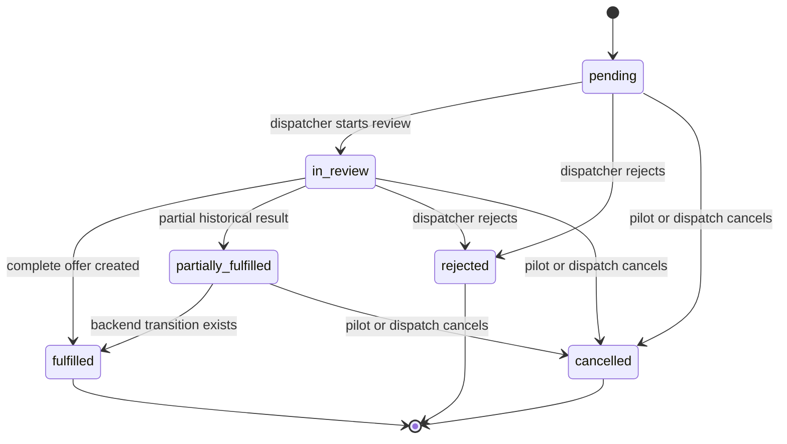

# Scheduling and Dispatch

Schedule requests let a pilot state when they are available and how many flights they want. Dispatch converts a request into canonical flight records; the request itself remains the historical planning record.

## Request data

A schedule request contains:

- tenant and pilot membership IDs;
- optional title and notes;
- overall `windowStart` and `windowEnd`;
- `desiredFlightCount`, from 1 to 50;
- flexible JSON `preferences`;
- numeric `version`, status, rejection/cancellation reason, and linked-flight
  counts; and
- creation/update timestamps.

The current web form stores detailed availability as:

```json
{
  "availability": [
    {
      "startAt": "2026-09-10T08:00:00.000Z",
      "endAt": "2026-09-10T12:00:00.000Z"
    },
    {
      "startAt": "2026-09-11T15:00:00.000Z",
      "endAt": "2026-09-11T19:00:00.000Z"
    }
  ]
}
```

The intervals are sorted before submission. The earliest start becomes `windowStart`; the latest end becomes `windowEnd`. This preserves a simple query window while keeping the precise intervals available to dispatch.

## Availability rules

The schedule form and API enforce:

- at least one interval;
- a valid start and end for every interval;
- end later than start;
- no overlapping intervals;
- 1–50 desired flights;
- title up to 120 characters; and
- notes up to 2,000 characters.

All `datetime-local` values are converted as UTC / Zulu. The API normalizes and
sorts detailed intervals, rejects overlaps or invalid ranges, and verifies the
overall window matches the detailed availability. Request-linked flights must
fit a detailed interval.

## Request state machine



`fulfilled`, `rejected`, and `cancelled` are terminal. A
`partially_fulfilled` request remains active and can receive another atomic
batch until its requested capacity is reached.

## Pilot experience

The pilot dashboard refreshes requests and flights every 30 seconds. It separates:

- active requests: `pending`, `in_review`, `partially_fulfilled`;
- offered flights needing a decision;
- upcoming accepted or briefed flights; and
- recent terminal history.

A pilot can version-edit an owned `pending` request until dispatch starts review.
If another actor changes it first, the editor reloads the current version and
requires review before retrying.

A pilot can cancel an owned request in `pending`, `in_review`, or
`partially_fulfilled` state. The cancellation dialog requires one of two linked-
flight policies: keep every linked flight, or cancel eligible pre-departure
flights atomically. Active and terminal history is never silently rewritten.

## Dispatcher request queue

The dispatcher queue is tenant-wide and cursor-paginated, with filters for:

- pending;
- in review;
- fulfilled;
- rejected;
- cancelled; and
- historical partial.

Dispatchers can start review from the queue or open the full request workspace. The workspace displays pilot identity, overall window, precise availability slots, notes, request actions, offer builder, and linked canonical flights.

## Building a complete offer

For an in-review or partially fulfilled request, the offer builder shows the
remaining capacity and lets dispatch choose a batch size from one through that
remainder. Each row requires:

- flight number;
- four-letter departure ICAO;
- four-letter arrival ICAO;
- ETD in UTC;
- ETA in UTC and after ETD; and
- optional aircraft type.

One submission calls `POST /flights/bulk` with the current request version and
a stable `Idempotency-Key`. The backend locks the request before linked flights,
rechecks cumulative capacity and normalized availability, assigns the owning
active pilot, links each flight, and creates it as `offered`.

The request becomes `partially_fulfilled` while capacity remains and `fulfilled`
when complete. An exact same-key retry returns the original ordered result;
reusing a key for a different payload is a conflict.

### Concurrency and safety

- Every edit, transition, fulfillment, and cancellation compares the stored
  request version.
- Request fulfillment and its flights/audits commit atomically.
- The required cross-domain lock order is schedule request before flights.
- Single-flight creation is ad-hoc only; clients cannot bypass cumulative
  request fulfillment by attaching a request ID there.

## Rejecting and cancelling

Dispatch can reject a `pending` or `in_review` request with an optional explanation. Rejection is terminal and the reason is visible to the pilot.

Dispatch can cancel the same states a pilot can cancel. Cancellation is operationally distinct from rejection:

- **Rejected** means dispatch made a terminal decision not to fulfill the request.
- **Cancelled** means the request was withdrawn or stopped.

Neither action deletes history.

## Ad-hoc dispatch creation

The flight-management view can create a flight without a schedule request. A dispatcher enters route, schedule, aircraft, notes, pilot, and initial status.

- A draft may be unassigned.
- An offered flight requires an active pilot membership from the same tenant.
- Request-linked creation is rejected here and must use the bulk workflow.

See [Flights and State Machines](https://github.com/shiftbloom-studio/va-dispatcher/wiki/Flights-and-State-Machines) for the operational lifecycle after creation.

## Audit trail

The API writes audit events for:

- request creation;
- every request status transition;
- single-flight creation;
- bulk flight creation;
- flight edits; and
- flight transitions.

Administrators can search the audit viewer and request a bounded, access-audited
export. Audit metadata records version changes without copying secrets.

## Safe extension checklist

When extending request or generation behavior:

1. Preserve tenant and pilot ownership checks.
2. Define allowed states and concurrent-update behavior first.
3. Validate detailed interval semantics on the server.
4. Preserve idempotency for create/generate operations.
5. State explicitly whether cancellation cascades, and make it transactional.
6. Keep canonical flights separate from transient generator output.
7. Update API serializers, OpenAPI, web Zod schemas, UI action matrices, audit metadata, and tests together.
