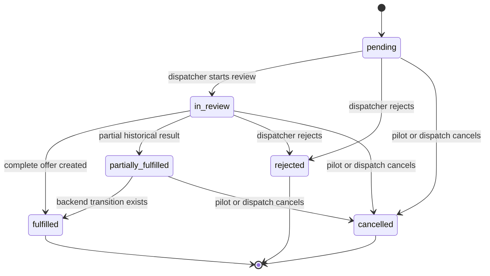

# Scheduling and Dispatch

Schedule requests let a pilot state when they are available and how many flights they want. Dispatch converts a request into canonical flight records; the request itself remains the historical planning record.

## Request data

A schedule request contains:

- tenant and pilot membership IDs;
- optional title and notes;
- overall `windowStart` and `windowEnd`;
- `desiredFlightCount`, from 1 to 50;
- flexible JSON `preferences`;
- status and optional rejection reason; and
- creation/update timestamps.

The current web form stores detailed availability as:

```json
{
  "availability": [
    {
      "startAt": "2026-09-10T08:00:00.000Z",
      "endAt": "2026-09-10T12:00:00.000Z"
    },
    {
      "startAt": "2026-09-11T15:00:00.000Z",
      "endAt": "2026-09-11T19:00:00.000Z"
    }
  ]
}
```

The intervals are sorted before submission. The earliest start becomes `windowStart`; the latest end becomes `windowEnd`. This preserves a simple query window while keeping the precise intervals available to dispatch.

## Client-side availability rules

The schedule form enforces:

- at least one interval;
- a valid start and end for every interval;
- end later than start;
- no overlapping intervals;
- 1–50 desired flights;
- title up to 120 characters; and
- notes up to 2,000 characters.

All `datetime-local` values are converted as UTC / Zulu. The API independently checks the overall window ordering and flight-count range, but detailed `preferences.availability` remains a flexible JSON contract. Any caller outside the web UI must preserve the same interval rules itself.

## Request state machine



`fulfilled`, `rejected`, and `cancelled` are terminal. The current UI treats `partially_fulfilled` as historical and does not expose an append-offer workflow.

## Pilot experience

The pilot dashboard refreshes requests and flights every 30 seconds. It separates:

- active requests: `pending`, `in_review`, `partially_fulfilled`;
- offered flights needing a decision;
- upcoming accepted or briefed flights; and
- recent terminal history.

A pilot can cancel an owned request in `pending`, `in_review`, or `partially_fulfilled` state. Cancellation changes only the request status. It does not cancel, delete, or alter any linked flights.

There is no schedule-request edit endpoint today. To change availability or flight count, the pilot must cancel an eligible request and submit another one.

## Dispatcher request queue

The dispatcher queue is tenant-wide and cursor-paginated, with filters for:

- pending;
- in review;
- fulfilled;
- rejected;
- cancelled; and
- historical partial.

Dispatchers can start review from the queue or open the full request workspace. The workspace displays pilot identity, overall window, precise availability slots, notes, request actions, offer builder, and linked canonical flights.

## Building a complete offer

For a pending or in-review request, the offer builder renders exactly `desiredFlightCount` rows. Each row requires:

- flight number;
- four-letter departure ICAO;
- four-letter arrival ICAO;
- ETD in UTC;
- ETA in UTC and after ETD; and
- optional aircraft type.

One submission calls `POST /flights/bulk`. The backend assigns each created flight to the request's pilot unless a pilot override is supplied by an API caller, links it to the request, and creates it as `offered`.

The backend then updates the request status based on the created batch count. The normal web flow submits the exact requested count and ends at `fulfilled`.

### Important current boundaries

- The web form checks ETA after ETD; the API's basic route schema currently accepts any two dates.
- The web form shows availability to the dispatcher but does not server-enforce that each flight lies inside a detailed interval.
- Bulk creation has no caller-provided idempotency key. Do not automatically retry an ambiguous request without checking whether flights were already created.
- A cancelled request does not cascade to linked flights.
- The current partial-request UI does not append a later batch.

These are current contract boundaries, not behavior to silently work around in a client. Changes require backend validation, state-machine, audit, OpenAPI, and test updates.

## Rejecting and cancelling

Dispatch can reject a `pending` or `in_review` request with an optional explanation. Rejection is terminal and the reason is visible to the pilot.

Dispatch can cancel the same states a pilot can cancel. Cancellation is operationally distinct from rejection:

- **Rejected** means dispatch made a terminal decision not to fulfill the request.
- **Cancelled** means the request was withdrawn or stopped.

Neither action deletes history.

## Ad-hoc dispatch creation

The flight-management view can create a flight without a schedule request. A dispatcher enters route, schedule, aircraft, notes, pilot, and initial status.

- A draft may be unassigned.
- The web UI requires an active pilot before creating an offered flight.
- The backend record allows a nullable pilot field, so non-web API clients must not create an unassigned offer.

See [Flights and State Machines](https://github.com/shiftbloom-studio/va-dispatcher/wiki/Flights-and-State-Machines) for the operational lifecycle after creation.

## Audit trail

The API writes audit events for:

- request creation;
- every request status transition;
- single-flight creation;
- bulk flight creation;
- flight edits; and
- flight transitions.

Audit records are persisted but there is no audit-log read API or web screen in the current application.

## Safe extension checklist

When adding request edits, partial appends, recurring availability, or generation automation:

1. Preserve tenant and pilot ownership checks.
2. Define allowed states and concurrent-update behavior first.
3. Validate detailed interval semantics on the server.
4. Add idempotency for create/generate operations.
5. State explicitly whether cancellation cascades, and make it transactional.
6. Keep canonical flights separate from transient generator output.
7. Update API serializers, OpenAPI, web Zod schemas, UI action matrices, audit metadata, and tests together.
