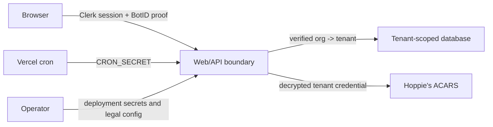

# Security and Privacy

VA Dispatch includes defense-in-depth and privacy-by-default controls, but the repository is not a security certification or a guarantee of GDPR/DSGVO compliance. The deployment operator remains the controller responsible for lawful bases, notices, contracts, retention, rights requests, incident response, and all jurisdiction-specific decisions.

## Trust boundaries



Compromise or misconfiguration at one boundary must not be assumed safe because another control exists.

## Implemented controls

### Authentication and tenant isolation

- Clerk JWT verification on business routes.
- Active organization required for business data; the narrow application route
  verifies a user without organization context and exposes no operational data.
- Narrow trusted bootstrap for only `VSAS_CLERK_ORG_ID`.
- Active local membership required.
- Three-way web agreement among URL slug, Clerk organization, and API tenant.
- Tenant-scoped repositories and explicit cross-tenant tests.

### Authorization

- Ranked pilot, dispatcher, and admin roles.
- Resource ownership for pilot schedule requests and flights.
- Dispatcher-only operations board, member list, and ACARS.
- Admin-only invitation/application decisions, tenant/member mutations,
  removal, directory sync, and Hoppie configuration.

### Abuse prevention

Vercel BotID protects all browser mutations, with Deep Analysis on expensive or external-provider routes. Client and server route policies are deliberately duplicated and must remain identical.

BotID is excluded from reads and secret-authenticated internal routes. It complements—not replaces—authentication, authorization, input validation, provider controls, and rate-aware design.

### Input and response contracts

- Zod validates route payloads, parameters, and queries.
- PostgreSQL unique constraints protect tenant membership/callsign identities and ACARS deduplication.
- The web parses every consumed success payload with Zod.
- Errors use a bounded public envelope and unknown errors hide internal details.
- Request IDs support correlation without exposing secrets.

### Secret handling

- Hoppie logons are tested before first storage.
- AES-256-GCM encrypts tenant credentials with a deployment key.
- Plaintext and ciphertext are omitted from responses.
- Provider errors are classified and sanitized.
- Production fails closed to Hoppie and never exposes the mock simulator.

### Browser and transport hardening

The Next.js service configures:

- Content Security Policy with `base-uri 'self'`, `frame-ancestors 'none'`, and `object-src 'none'`;
- `Referrer-Policy: strict-origin-when-cross-origin`;
- `X-Content-Type-Options: nosniff`;
- `X-Frame-Options: DENY`;
- restrictive Permissions Policy; and
- production HSTS.

The API applies corresponding secure headers, `Referrer-Policy: no-referrer`, frame denial, permissions restrictions, production HSTS, and explicit CORS origins. Swagger/ReDoc receive dedicated restrictive CSPs.

### Supply-chain and repository controls

CI runs formatting, linting, type checks, coverage, build, and browser tests. The security workflow runs:

- high-severity pnpm audit;
- pull-request dependency review; and
- CodeQL extended JavaScript/TypeScript analysis.

Actions are pinned to full commit SHAs. Keep `github/codeql-action/init` and `github/codeql-action/analyze` on the same SHA; CodeQL fails if those pins diverge. Repository administrators must still enable branch rulesets, secret scanning, push protection, private vulnerability reporting, and supported GitHub security features.

## Personal and linkable data inventory

| System                    | Data                                                                                                                              |
| ------------------------- | --------------------------------------------------------------------------------------------------------------------------------- |
| Clerk                     | User/org IDs, login/invitation email, role/invitation state, name, sessions, IP/device/security events                            |
| Memberships               | Clerk ID, active or requested role (according to status), display name, callsign, SimBrief/Navigraph identity, application/status |
| Schedule requests         | Availability, preferences, notes, status, reasons, timestamps                                                                     |
| Flights                   | Pilot assignment, route/schedule, notes, lifecycle reasons, OOOI fields                                                           |
| Dispatch planning         | Release revisions, weather/fuel/payload, remarks, SimBrief request/OFP                                                            |
| Simulator telemetry       | Device identity, position/phase samples, recent track, OOOI provenance                                                            |
| ACARS                     | Station identifiers, message text, provider metadata, actor, timestamps                                                           |
| Audit events              | Actor, action, entity IDs, metadata, time                                                                                         |
| Privacy operations        | Policy, request/hold/task state, approvals, reports, export cursor                                                                |
| Infrastructure            | Request IDs, IP and HTTP/security logs at providers                                                                               |
| Optional Vercel telemetry | Consent-gated aggregated page/referrer/device/coarse location and Web Vitals data                                                 |

Treat every free-text field as potentially personal. Do not solicit sensitive or unrelated information.

## Browser privacy controls

Authentication cookies and BotID are treated as necessary service/security processing. Optional Vercel Web Analytics and Speed Insights remain off until affirmative consent.

The browser stores one local preference record:

```json
{
  "version": "2026-08-12.2",
  "decidedAt": "2026-08-12T12:00:00.000Z",
  "analyticsAllowed": false
}
```

The legal-notice version invalidates an old decision after material notice changes. Preferences synchronize across open tabs. After analytics has initialized, withdrawal blocks every future event through a per-event consent check while leaving the clients mounted for stable application behavior.

There is no advertising, marketing tracker, social plugin, remote font, map, or embedded-media service in the current user application.

Before adding an optional browser service:

1. Update the data/cookie inventory and provider contracts.
2. Update the privacy notice and increment its version.
3. Implement purpose-specific, off-by-default consent.
4. Prevent any load, request, storage, or iframe before consent.
5. Make rejection and withdrawal as easy as acceptance.
6. Test fresh, rejected, accepted, withdrawn, expired, and cross-tab states.

## Public legal pages

`/impressum` and `/privacy` are public and Clerk-free. Production rendering requires real legal operator, address, email, privacy contact, and supervisory-authority configuration. Placeholder or malformed values fail rather than being published.

Hosted modified forks must set `NEXT_PUBLIC_SOURCE_URL` to the corresponding deployed source as required by AGPL-3.0-or-later.

Do not restore the discontinued EU ODR-platform link or add generic liability/copyright boilerplate that conflicts with the actual operator or AGPL license.

## Hoppie is not confidential

Hoppie is an external store-and-forward operational network. Messages can be visible to others and may remain queued outside VA Dispatch. Never send credentials, private contact data, confidential material, special-category data, or real-world safety-critical instructions.

The application stores outbound logical messages including uncertain outcomes
and polled inbound traffic. Flight linking does not make a message private.

## Privacy operations and operator obligations

The admin privacy control plane supports approved/versioned retention policy,
dry-run and resumable execution, verified export, correction, restriction,
objection, anonymization/erasure, legal holds, and external-provider tasks.
Sensitive free-text and provider payloads are included in inventory and export
rules. Execution is bounded, tenant-scoped, audited, and uses dual control for
material destructive actions.

That tooling does not select a lawful basis, approve a retention schedule,
certify compliance, delete a provider's independent data, or verify every
backup. Before production, the controller must still establish:

Before production, the controller must establish:

- processor agreements for Clerk, Vercel, and Neon;
- subprocessor and international-transfer assessment;
- an approved retention schedule for every data store and backup;
- approved retention and data-subject operating procedures around the software;
- least-privilege access reviews and offboarding;
- credential and encryption-key rotation;
- backup restore tests;
- incident and breach response, including the applicable 72-hour assessment;
- records of processing and legitimate-interest assessments where required; and
- decisions on DPO, representative, DPIA, and minor-user safeguards.

Provider and backup actions remain explicit tracked tasks until an operator
verifies completion. The audit table is operational evidence, not a tamper-
evident external ledger.

## Security reporting

Do not open a public issue for a vulnerability. Follow [`SECURITY.md`](https://github.com/shiftbloom-studio/va-dispatcher/blob/main/SECURITY.md) and email `hello@shiftbloom.studio` with the documented subject and a redacted reproduction.

Never include real credentials, personal data, production database content, or destructive payloads in a report.

## Change-review checklist

For any auth, tenant, provider, database, or privacy change, review:

- identity and tenant derivation;
- role and resource ownership;
- BotID client/server policy parity;
- route Zod and web response schemas;
- secret exposure in responses, logs, errors, tests, screenshots, and audit metadata;
- cross-tenant and disabled-membership cases;
- legal notice and data inventory;
- retention/export/deletion implications;
- security headers and external origins; and
- unit, integration, browser, and production verification.
